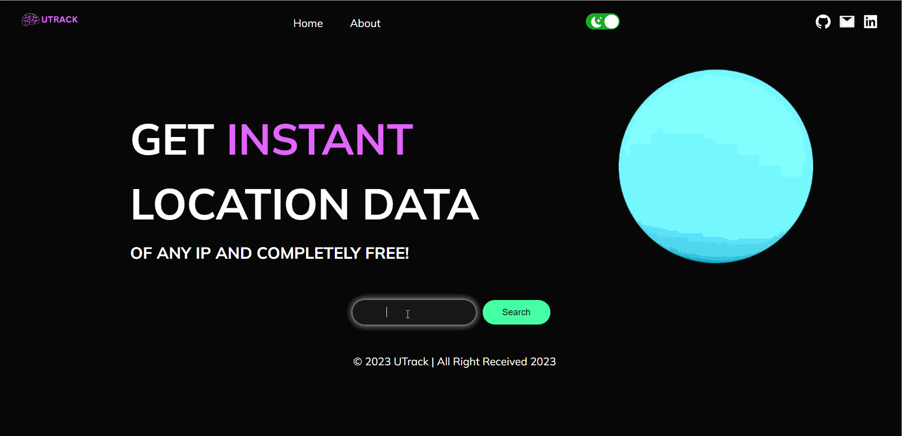

# Project Title

UTRACK

## Project Description

IP Geolocation Application with map, built with Next.js 13

## Table of Contents

- [Installation](#installation)
- [Usage](#usage)
- [URL](#url)
- [Technologies](#technologies)
- [Development](#development)
- [Author](#author)

## Installation

1- Clone the repository:
git clone https://github.com/Abdalrzakalsouki/UTrack.git

2- Navigate to project directory:
cd utrack

3- Install dependencies:
npm install

4- Run the project:
npm run dev

## Usage

## url

Live Site URL: (https://u-track.vercel.app/home)

## Technologies

- Nextjs 13
- TypeScript
- SCSS, CSS modules
- REST API
- NPM Libraries

## Development

Upcoming featuers:

- PWA
- Improve Accessibility
- Improve Performance
- Google Tracking
- IP Verification
- Buy Me Coffee

## author

- LinkedIn - [@abdulrazzakalsssouki](https://www.linkedin.com/in/abdulrazzakalsssouki)
